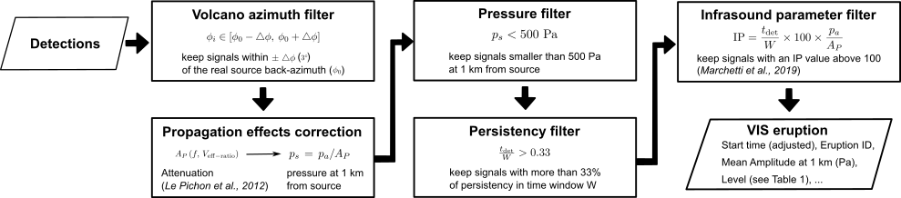
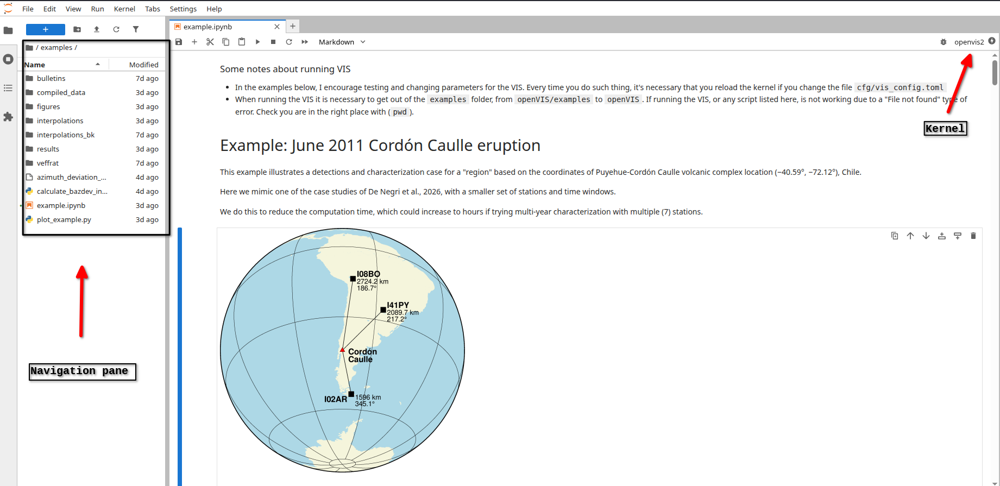

# openVIS
Open source implementation of the Volcanic Information System methodology


_Workflow of the VIS methodology. Figure from [De Negri et al. (2026, in review)]()._

## Goal

The Volcanic Information System (VIS) is a long-range (>250 km) detection and characterization infrasound-based methodology.

The VIS aims to enable near-real-time monitoring of volcanic eruptions,
and it's designed to use infrasound array detections similar to the
bulletins from the International Monitoring System infrasound network
([see IMS map](https://www.ctbto.org/our-work/ims-map)),
which has a global network of infrasound arrays (54 ot 60 planned; see [Marty, 2019](https://doi.org/10.1007/978-3-319-75140-5_1)).

Currently, this code is only able to perform analysis with "historical"
data, that is, not real-time analysis.
We hope to extend the functionality to real-time use in the future,
provided real-time access to infrasound bulletins, 
including non-IMS infrasound arrays, increases.

### What is an infrasound detection?
The detections are the output from array processing techniques like 
the Progressive Multichannel Correlation Method 
(PMCC; [Cansi, 1995](https://doi.org/10.1029/95GL00468)),
usually referred as _bulletin files_ (or _bulletins_),
which contain lists of coherent waves which pass through the multiple
acoustic sensors of the array.
These are usually characterized by time, duration, amplitude (Pa),
mean frequency (Hz), and number of _pixels_.
A _pixel_ represents one wavefront. 
When correlative _pixels_ hold similar characteristics (frequency, amplitude, travel time, etc.), 
they are grouped into a detection. 
Groups of detections are a bulletin file.

In the examples of this repository, 
as well as the paper that accompanies it 
([De Negri et al., 2026 (in review)]()),
we use open-access (OA) infrasound bulletins 
which are the re-processing products of PMCC bulletins
from the IMS network
([Hupe et al., 2022](https://doi.org/10.5194/essd-14-4201-2022)).
Specifically, we use the "high-frequency" (1-3 Hz) open-access bulletins,
which can be downloaded from the [German Federal Institute for Geosciences and Natural Resources (BGR) geoportal](https://geoportal.bgr.de/mapapps/resources/apps/geoportal/index.html?lang=en#/search?term=10.5194%2Fessd-14-4201-2022&core&filter=%7B%22md_type_facet%22%3A%5B%22Daten%22%5D%7D) (it should be the dataset named "Higher frequency data products of the International Monitoring System’s infrasound stations").

## History and Acknowledgments

The Volcanic Information System (VIS) was created within the Atmospheric
dynamics Research InfraStructure in Europe (ARISE) project,
under the European Commission's programs FP7 and H2020.

This code was started by Thibault Arnal during his early career at 
CEA/DAM/DIF, France, 
then continued by Vincent Boulenger during his internship thesis 
project at the Laboratoire Magmas et Volcans (LMV),
Universite Clermont Auvergne, France, 
and further modified by me
(Rodrigo De Negri) during my postdoc at LMV, France as well.

The code has been released in an effort to involve a larger volcano
monitoring community that may be interested in testing and developing 
the VIS, based on their specific needs.

Suffice to say, 
I am not a software developer (as Thibault and Vincent are),
so the current version of the code is not _professional-grade_
(except for the bits the previous developers created),
although it has been thoroughly tested during my research,
and modified to fulfill my research needs,
which I hope are not far off from other volcano/infrasound researchers
needs.
However, more of work needs to be done for improving the documentation
of the inner parts of the code, testing, and generally streamlining 
it's use. 
Please use it as an _in-development_ code and be careful with the 
interpretations you do from it's output.

The current version has been a collaborative effort with other researchers from Europe (sorted by first name):
- Alexis Le Pichon (CEA/DAM/DIF, France)
- Emanuele Marchetti (UNIFI, Italy)
- Duccio Gheri (UNIFI/Liverpool, Italy/UK)
- Patrick Hupe (BGR, Germany)
- Peter Näsholm (NORSAR, Norway)
- Philippe Labazuy (LMV, France)

Many thanks to them for their full support.

Previous to the release of this code, 
we organized a hands-on workshop at UNIFI 
(28-29 August 2025, Florence, Italy),
for other researchers thanks to
[Geo-INQUIRE (project HORIZON-INFRA-2021-SERV-01)](https://www.geo-inquire.eu/dissemination/workshops/volcanic-information-system).
This experience was important to see how reproducible the 
results could be,
and how to improve the overall functionality for broader use.

The bulk of this methodology has been documented in:
- [Marchetti et al. (2019)](https://doi.org/10.1038/s41598-019-54468-5): IP long-range (>500 km) development and test on Etna volcano, Italy.
- [Gheri et al. (2023)](https://doi.org/10.1016/j.jvolgeores.2023.107753): use of IP from IS06 to characterize volcanic eruptions in Indonesia (~1000-2000 km).
- [Gheri et al. (2025)](https://doi.org/10.1016/j.jvolgeores.2025.108320): first global, systematic use of VIS methodology with historical data (2010-2019) from infrasound stations at ~1000-2000 km from active volcanoes.
 
Other important parts as well in:
- [Le Pichon et al., (2012)](https://doi.org/10.1029/2011JD016670): the attenuation coefficient formula, implemented in this code.
- [Ripepe et al. (2018)](https://doi.org/10.1029/2018JB015561): first use of IP idea and tests with local data from Etna, Italy.
- [De Negri and Matoza (2023)](https://doi.org/10.1029/2022JB025735): release or ARCADE methodology and test with 2011 Cordón Caulle and 2015 Calbuco eruptions, Chile.
- [De Negri et al. (2025)](https://doi.org/10.1093/gji/ggaf027): ARCADE methodology applied to multi-year datasets to test temporal resolution on volcanoes from the Vanuatu Archipelago.

The updated methodology behind this code has been documented in [De Negri et al. (2026)]().

_Note: none of this code or the writing was made with LLM/genAI tools. We thrive for reproducible research, want to acknowledge the efforts of all previous developments in the methodology, and hope this code is used following those principles as well._

## How to cite

Please cite as part of the following paper:
- [De Negri et al. (2026, in review)]()

and as the Zenodo repository as well:
- [ADD ZENODO REPO HERE]()

## How to use

### Basic dependencies

This code has been developed and tested under Ubuntu 24.04. For simplicity, I'll assume you know how to work in the terminal and know some linux commands like `cd`.

Make sure you have `conda` installed. I recommend to follow the instructions for the basic install instructions of miniconda (not the whole suite) from the Linux terminal installer (see [here](https://www.anaconda.com/docs/getting-started/miniconda/install#linux-terminal-installer)).

Open a terminal, and go to the location of the project folder in your computer (the `$` is just to symbol you are in the terminal prompt):

`$ cd /path/to/openvis`

Create a "conda environment", which will satisfy the necessary Python dependencies with:

`$ conda env create -n openvis numpy pandas xarray netcdf4 toml tqdm obspy -c conda-forge`

Note that:
- the conda environment name will be `openvis`
- the default Python version that conda currently installs in Ubuntu 24.04 is 3.13.11
- we are including `conda-forge` (see [here](https://conda-forge.org)) as an extra source for the modules like `obspy` (see [here](https://docs.obspy.org)).

To activate the conda environment, do:

`$ conda activate openvis`

Now all the Python dependencies should be available to run the VIS from the current session in your terminal. Make sure to always have the 'openvis' environment activated before running the VIS.

#### Extra dependencies to test the example
To test the example in (`examples/example.ipynb`) you need to add two extra dependencies to the current `openvis` environment:

`$ conda install matplotlib jupyterlab`

(note that you could also create a new environment to separate the output/debugging environment from the "run" environment if you want to keep things separated).

### Code structure

After downloading/cloning this repository in your computer, the file structure should look like this (within `openVIS` folder):

The `cfg` folder, containing the configuration files:

```
cfg 
├── stations.csv -> file with example available stations in name,lat,lon CSV format (see header)
├── vis_config.toml -> configuration file for VIS run, here all the parameters are set. See below for detailed description.
└── volcanoes.csv -> CSV list of volcanoes separated by ';' and in European number format. Comes from Smithsonian. See header for more detailed column description.
```

The `src` folder, containing the actual code:
```
src
├── db_vis.py -> deals with 'database' creation (in reality, Pandas DataFrames in Python binaries), and loading of data into them
├── eruption.py -> defines Eruption class plus other eruption-related functions
├── infrasoundlib
│   ├── attenuation.py -> deals with the calculation of the attenuation coefficient (Le Pichon et at., 2012)
│   ├── detection.py -> defines Detection class
│   ├── __init__.py
│   ├── station.py -> defines Station class
│   ├── util.py -> math utilities
│   └── vratio.py -> defines Vratio class
├── infrasound_parameter.py -> defines with Infrasound Parameter class (IP)
├── __init__.py
├── logger.py -> nice logger function
├── models.py -> helps with creation of DataFrames
├── progress.py -> nice progress bar
├── region.py -> defines the Region class
├── settings.py -> translates parameters defined in `vis_config.toml` to the model
├── station_volc.py -> here the IP is calculated, within the class StationVolc
├── vis_main.py -> main code, is the one called to run the VIS
└── volcano.py -> defines Volcano class
```

The `examples` folder, containing some illustrative examples in Jupyter Notebooks (`.ipynb`) and useful Python scripts.
```
examples/
├── azimuth_deviation_table.txt --> example ARCADE back-azimuth table
├── bulletins --> data to test
│   ├── IS02_2011_hf_1-3Hz_5min.nc
│   ├── IS08_2011_hf_1-3Hz_5min.nc
│   └── IS41_2011_hf_1-3Hz_5min.nc
├── calculate_bazdev_interpolation.py --> example interpolation script
├── example.ipynb --> Jupyter notebook, open this first.
├── figures --> place where figures will be saved (plus map)
│   └── Map_globe_30p.png
├── interpolations --> example interpolations from ARCADE table above
│   ├── Puye_I02AR.pkl
│   ├── Puye_I08BO.pkl
│   └── Puye_I41PY.pkl
├── plot_example.py --> example script to plot VIS results
└── veffrat --> example veff-ratio files 
    ├── veff50_I02AR_2011-2011_VIS.mat
    ├── veff50_I08BO_2011-2011_VIS.mat
    └── veff50_I41PY_2011-2011_VIS.mat

```

The `figures` folder, with some figures for this README:
```
figures/
└── vis_diagram.png --> diagram
```
 
An the LICENSE (CeCILL FREE SOFTWARE LICENSE AGREEMENT v2.1):
```
LICENSE --> license as plain text file
```


### Configuration parameters

The file `cfg/vis_config.toml` contains the parameters that 
should be modified for each specific VIS run. 
This file is formatted following the [Toml easy to read format](https://toml.io/en/).

`vis_config.toml` comes with comments explaining the meaning of each parameter. In the following section I explain in more detail what they are.

#### Section `[DATES]`
Most of the parameters have self explanatory names. 
For example `StartDate` and `EndDate` in section `[DATES]` indicate 
the start and end dates and time for the VIS to search for eruptions.

#### Section `[VOLCANOES]`

Note the parameters `VolcanoesTable` and `StationsTable` in section `[VOLCANOES]`
point towards the files `cfg/volcanoes.csv` and `cfg/stations.csv`.
This means the files could be named
differently, and tuned for specific regions or cases of interest. For example,
a different file containing local stations could be created in the same format
as `stations.csv` and saved for a specific area of monitoring (or the same
stations could be simply appended to the file, it's up to you).

The parameters `Area`, `Regions`, and `VolcanoesList` are used to 
declare the kind of monitoring setting that is used.
- When `Area` is defined, it serves to define the lower left 
and upper right corners of a rectanle in a (Latitude, Longitude) format. When this parameter is used, the VIS will use the center of the
rectangle as the reference point to monitor the area.
Please note:
	- If `Area` is used, `Regions` and `Volcanoes` are skipped (i.e., takes precedence), so
	- `Area` needs to be empty (`Area = []`) if not using it.

- When `Regions` is used, it contains one or more lists of volcanoes by
  name or code (as defined in `cfg/volcanoes.csv`).
The VIS will monitor the center location of each defined region, considering the coordinates of each volcano on it.
Please note:
	- `Regions` (groups of volcano locations) can be combined with `VolcanoesList` (individual volcano locations).

- When `VolcanoesList` is used, it contains volcano names or codes separated by commas.
In this case, the VIS will look for eruptions at the individual location
of each volcano.

#### Section `[STATIONS]`

The parameter `StationList` defines a list of stations selected 
to be used by the VIS to get the bulletins of detections.
The names should correspond to the ones defined in `StationsTable`
(by default, the file `cfg/stations.csv`).
Note that the parameter `MaxDist` in section `[PROCESSING]` 
is a threshold value that could force to skip stations in `StationList`
if they are farther than `MaxDist` (in km) to each monitored location.

#### Section `[PATHS]`

This section defines all the paths to the folders that have 
the input data, and the output results.
- `VeffRatios` defines the path to where the "veff-ratio" 
(effective sound speed ration at stratosphere (~50 km) and ground; see [De Negri et al., 2026]()) files will be located.
Each file should have the naming convention formats as the following examples:
	-	`veff50_I41PY_2011-2015_VIS.mat` for a set of values for station I41PY (IS41) from 2011 to 2015, if put together in a Matlab binary (`.mat`).
	-	`veff50_I51GB_2021_VIS.mat` for a set of values for station I51GB (IS51) for 2021 as a Matlab binary (`.mat`).
	-	`2011_I08BO_veff-ratios.nc` for a set of values for station I08BO (IS08) for 2011 as a netCDF binary.

	Note that the station names have to be defined in `cfg/stations.csv`.

	In general, 
	the veff-ratio files should be defined as a time series 
	from `StartDate` to `EndDate`,
	with 361 veff-ratio values from 0 to 360 degrees 
	(i.e., a whole circle in steps of 1 degree) for each time.
	In `examples/example.ipynb`, 
	the explicit structure of a Matlab binary is shown.

	The structure for the netCDF binaries should be similar. Please check
	the functions `fill_vratio_clim` and `read_veffrat_bgr` 
	in `src/db_vis.py` for more details about the current implementations. You could of course make your own, based on the atmospheric specifications you prefer.

	**Important:** If the folder defined by `VeffRatios` is empty, or there are times where no veff-ratios are provided, the veff-ratios will be defined as `1.0`, effectively _forcing_ good-enough stratospheric ducting conditions on the search.

- `Bulletins` defines the path to where the bulletins of detections are located.
The identification of bulletin file types is dependent on the naming convention
defined in the `load_bulletins` function in `src/db_vis.py`. The corresponding implementation details for each type of data are referenced in the function `load_file`.
The naming format for each file depends on the data type it will be used, which currently are decribed below: 
	- For the open-access PMCC binaries, each file should be on the form `IS09_2015_hf_1-3Hz_5min.nc` for station IS09 (I09BR), year 2015. These files directly come from the OA multiyear repository by [Hupe et al., 2022]().
	- For PMCC like the one used for [Gheri et al. (2025)](), the data should be named as `XYZ_YYYYMMDD_YYYYMMDD.mat` or `ISXY_YYYYMMDD_YYYYMMDD.mat` (`YYYY` is the year, `MM` is the month, and `DD` is the day; both dates are normally different, of course). These binaries come from PMCC-like processing Matlab scripts implemented at UNIFI, Italy.
	- For 26-band PMCC bulletins the data should be named as `bull57_*.mat`,
	that is,
	it starts with `bull57_` and has an extension `.mat` (Matlab binary).
	These binaries come from PMCC processing made at BGR, and were used to create the open-access version binaries.
	- Plain text bulletin files ending in `.YYYY.bulletin.txt`, where `YYYY` is the year. These are simple files containing a row per detection, and 18 columns separating the start time, end time, number of pixels, etc. For historical reasons, these data type is labeled as `ARISE`.


- `BackAziInterp` is the path to the interpolations that can be calculated with
the back-azimuth deviation tables with [ARCADE](https://github.com/rodrum/arcade). This is an optional folder,
that could be declared as `false` if no interpolations are available.

	The naming format should be as `Puye_I02AR.pkl`, where `Puye` are the first four letters of the volcano name listed in `volcanoes_list.csv`, and `I02AR` (IS02) is the name of the station. The extension `.pkl` means these files are Python "pickle" binaries, which are described in detail in `examples/example.ipynb`.

- `CompileData` is the path to where the output Pandas DataFrames 
will be saved for common files like the bulletin datasets.
After running the VIS, the output common inside the folder defined in `CompileData` should be:
	```
	detections.pkl
	processed_files.txt
	stations.pkl
	veff_ratios.pkl
	volcanoes.pkl
	```
	Each one of the `.pkl` files contains a Pandas DataFrame structure, and will be updated if more stations, detections, volcanoes, and/or veff-ratios are used (in the example we inspect them in more detail).

	The file `processed_files.txt` is simply a list of processed files, that serves to not reload data that has already been read. If this file is changed or removed, the VIS will reload everything. For example, if using OA data for 2005 for the stations I27DE (IS27) and I49GB (IS49) with their respective veff-ratio files, this case could contain:
	```
	IS27_2005_hf_1-3Hz_5min.nc
	IS49_2005_hf_1-3Hz_5min.nc
	veff50_I27DE_2005_VIS.mat
	veff50_I49GB_2005_VIS.mat
	```

- `Results` is the path to where the DataFrame results will be stored after running the VIS. Many 'runs' can be performed over the same datasets, with different run parameters. Here each one of them is saved in a folder with that contains the date and time of the run, for example, if looking inside the `Results` path, you would see something like:
	```
	20251003T231553/
    	├── 20210101T000000_20211231T000000.1volcs.0regions.3stats.BGRveff.UsingBazdev.toml
    	├── assoc_sta_er.pkl
    	├── assoc_volc_er.pkl
    	├── eruption_results.pkl
    	└── ip_results.pkl	
	```
	This means the run was done on 2025-10-03 at 23:15:53 UTC. 

	Note that inside the `20251003T231553` folder, the file that ends in `.toml` (very long name) contains a backup of the configuration file `vis_config.toml` that was used to obtain the results. 
The name of this file starts with the start date and end date of the run (`StartDate_EndDate`), followed by several parameters that are useful to quickly understand the type of run it was separated by dots. Here `1volcs` means the run contained a single volcano, `0regions` that it did not contain a region, `3stats` that it used three stations, `BGRveff` that the veff-ratios were Matlab binaries, and `UsingBazdev` that there are interpolations with back-azimuth deviations in the path `BackAziInterp`.

	Each one of the `.pkl` (Python "pickle" binary) files contains a Pandas DataFrame with a table that has the results of the run. The file `eruption_results.pkl` contains the actual results of searching over the volcano(es)/region(s). We look into these files in `examples/example.ipynb` as well.

#### Section `[FORMATS]`

The only parameter here is `VeffFormat`, which should be either
`'BGR'`, `'CLIM'`, or `false`.

`BGR` (binaries shared by the BGR, based on [ECMWF](www.ecmwf.int) high-resultion profiles) means the veff-ratios are Matlab binaries. See `examples/example.ipynb` to get an idea of how these binaries look.

`CLIM` (after using empirical climatologies to calculate them) means the files are netCDF binaries (`.nc`), with a similar structure to the above. This is an implementation I have tried that allows for a good-enough realistic approach, but requires you to manipulate the Horizontal Wind Model ([Drob et al., 2015](https://doi.org/10.1002/2014EA000089)) and MSIS2.0 libraries ([Emmert et al., 2020](https://doi.org/10.1029/2020EA001321)).

`false` is set when no veff-ratio data are available, forcing the VIS to assume they are 1. 

_Note: `[FORMATS]` is a somewhat redundant. In the future I'd like to induce the format of each file by the file name only (as it happens with the bulletins)._

#### Section `[PROCESSING]`

- `WindowLength` is the size of the processing moving window 'W' in seconds.
- `Timeshift` is the size of the time step 'dt' in seconds.
- `PersistencyThreshold` is the persistency threshold value in percentage of W.
- `Dazim` is the back-azimuth static threshold in degrees.
- `MaxDist` is the threshold distance from the monitored point to the station.
- `MaxAmp` is the threshold amplitude in Pascals (usually 500).
- `IPThreshold` is the Infrasound Parameter (IP) threshold (usually 100).
- `NotificationInterval` is not used, but will serve to check for eruptions
    and send notifications.
- `DeltaClose` is the minimum time interval in seconds that will be used to
    declare an eruption as 'ended'.
- `NumBazStd` is the number of back-azimuth standard deviations to search for candidate detections, used when back-azimuth interpolations are included. This value is not used by default, while `Dazim` is used around the back-azimuth interpolation instead to more easily determine a back-azimuth tolerance threshold.
- `StaCloseConfidence` is the value in km to determine the "confidence" (in a relaxed way) of an eruption, based on the following criterion:
	- Level 1 (low): there is one station at > 500 km detecting.
	- Level 2 (med): there are two stations at > 500 km detecting.
	- Level 3 (high): there is one station at less than 500 km detecting, or there are three stations at > 500 km detecting.
- `MinMeanFreq`/`MaxMeanFreq` is a minimum/maximum mean frequency in Hz to filter detections _upfront_. If using OA high-frequency data, the value 1 for the minimum and 3 for the maximum basically does not change the results. Note that there is a criterion of maximum frequency defined in the code relative to the range (`filter_detections` function in `src/vis_main.py`), based on [Brachet et al. (2010)](https://doi.org/10.1007/978-1-4020-9508-5_3) as well, which generally limits the maximum frequency as 4 Hz.
- `RefSpeed` this is the reference sound speed to calculate the default time
    delays in km/s.

### Examples

Inside the folder `examples`, I have included a minimal set of data that can be used to test the VIS. 

The bulletins come from the larger, multi-year (2003-2024) open-access datasets mentioned earlier (In "What is a detection" section),
which can be downloaded as well from the [Geoportal of the Federal Institute for Geosciences and Natural Resources (Germany)](https://geoportal.bgr.de/mapapps/resources/apps/geoportal/index.html?lang=en#/search?term=10.5194%2Fessd-14-4201-2022&core&filter=%7B%22md_type_facet%22%3A%5B%22Daten%22%5D%7D) as previously mentioned.

The python jupyter notebook `examples/example.ipynb` is the place to learn to run and visualize VIS results. It contains instructions and insights based on bulletins for three IMS station that were detecting around the eruption of June 2011 Cordón Caulle, Chile. You can access this Jupyter lab Python notebook by launching Jupyter lab after activating the conda `openvis` environment:
```
jupyter lab
```
This should open a tab in your browser with a navigation pane on the left where you find and open `example.ipynb`. Once inside, if the `openvis` kernel is selected, the _cells_ should be able to run without any issue. Follow the examples from top to bottom to avoid conflicts with the working path location, as it's necessary to leave the folder `examples` to run the VIS and then come back inside `examples` to plot results and to other analysis.

Once opening `example.ipynb` you should see something like below.

Note the extra labels showing the "navigation pane" and the place where you select the kernel (here is "openvis2", which I made to test this instructions, but it should be just "openvis" for you).

#### How can I select the `openvis` _kernel_ for the Jupyter lab?
To be able to select the `openvis` _kernel_ (environment) with all the satisfied dependencies, you need to do a couple of extra steps:
- In a terminal with `openvis` conda environment active, install `ipykernel`
	```
	conda install ipykernel
	```
- Now, make the `openvis` environment available as a kernel with
	```
	ipython kernel install --user --name=openvis
 	```
- Then deactivate the environment:
	```
	conda deactivate
	```
- Reactivate and relaunch the jupyter lab:
	```
	conda activate openvis
	jupyter lab
   	```

That should make `openvis` available as a _kernel_ within the tab where Jupyter lab is open (see Figure above).

#### How to run in a terminal

Please check `examples/example.ipynb` to learn how to set up the configuration file and analyze the results. Note that there are two example scripts to plot (`plot_example.py`) and calculate interpolations (`calculate_bazdev_interpolation.py`) in the folder `examples` as well.

In short, once the bulletin detections, veff-ratios (if any), and interpolations (if any) are in place, you should open a terminal and, from the project folder (`openVIS/`), run:
```
python -W ignore src/vis_main.py
```

Check the output of the run (we are suppressing some warnings with the option `-W ignore`, caused by the reading of the netCDF open-access bulletins). A folder named based on the day and time of the run will be stored where `Results` points to. For example, if set to `examples/results`, it would look like `examples/results/20251202T182425/`, where `20251202T182425` is the timestamp of the run. This name is mentioned in the output as well.


_Example figure containing the results of a VIS run with data searching for the 4 June 2011 eruption of Puyehue-Cordón Caulle, using data from I02AR (1596 km), I41PY (2089.7 km), and I08BO (2724.2 km). (a) to (c): log of IP values for each station, colored by mean frequency (see right vertical bar). (d): Eruptive periods in colored background by number of detecting stations (see right vertical bar). Black lines depict the mean amplitude of each period (see y-axis)._
